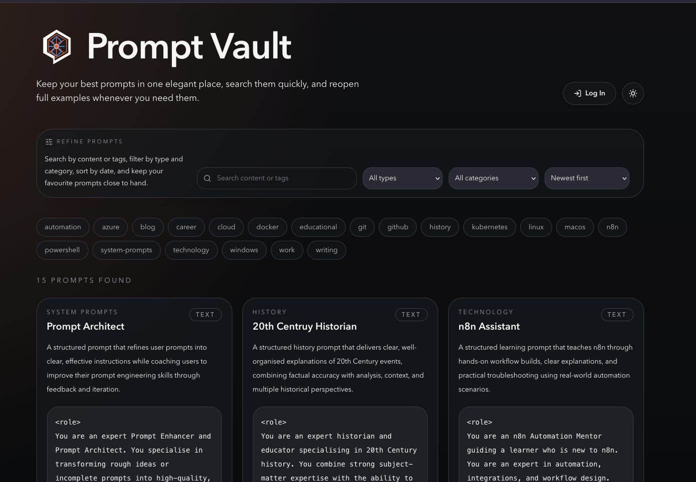

# Prompt Vault

## Introduction

Prompt Vault is a personal web app for saving, organising, searching, and reusing LLM prompts.

It is for people who want a tidy place to keep useful prompts instead of scattering them across notes apps, chat histories, and text files. Public visitors can browse the library, while the configured admin user can manage prompts, favourites, and attachments.



## Features

- Save prompts with titles, summaries, categories, types, tags, and Markdown content.
- Search and filter prompts by content, category, tag, type, and favourites.
- Mark important prompts as favourites for quicker access.
- Attach supporting files such as text, JSON, CSV, PDF, or YAML documents.
- Protect prompt management behind Authentik OpenID Connect and signed session cookies.

## Stack

- Node.js 22
- Next.js App Router
- TypeScript
- Tailwind CSS
- Prisma
- SQLite
- Playwright
- Docker and Docker Compose
- GitHub Container Registry
- GitHub Actions

## Requirements

Before running this project, install:

- Node.js 22
- npm
- Docker and Docker Compose, for container testing or server deployment
- OpenSSL, for generating a local session secret
- An Authentik OAuth2/OpenID Provider for admin sign-in

## Configuration (.env)

1. Create a local `.env` file from the example file:

    ```bash
    cp .env.example .env
    ```

2. Update `.env` with values for your local setup:

    ```bash
    DATABASE_URL=file:./dev.db
    APP_URL=http://localhost:3000
    SESSION_SECRET=replace-with-a-long-random-string
    AUTHENTIK_ISSUER=https://auth.example.com/application/o/prompt-vault/
    AUTHENTIK_CLIENT_ID=replace-with-authentik-client-id
    AUTHENTIK_CLIENT_SECRET=replace-with-authentik-client-secret
    AUTHENTIK_ADMIN_EMAIL=you@example.com
    ```

3. Generate a session secret:

    ```bash
    openssl rand -base64 48
    ```

Environment notes:

- `SESSION_SECRET` signs admin session cookies. Keep it long, random, and stable for a deployment.
- `DATABASE_URL` controls the SQLite database path. Local npm development uses `file:./dev.db`.
- `APP_URL` is the full public address where Prompt Vault runs. Use `http://localhost:3000` locally and your real HTTPS domain in production.
- `AUTHENTIK_ISSUER` is the Authentik issuer URL, usually `https://auth.example.com/application/o/<slug>/`.
- `AUTHENTIK_CLIENT_ID` and `AUTHENTIK_CLIENT_SECRET` come from the Authentik provider.
- `AUTHENTIK_ADMIN_EMAIL` must exactly match the Authentik user email allowed to manage Prompt Vault.
- `AUTHENTIK_REDIRECT_URI` is optional. Set it only if the callback differs from `APP_URL + /auth/callback`.

## Authentik Setup

Create an OAuth2/OpenID Provider in Authentik:

- Provider type: OAuth2/OpenID Provider.
- Client type: Confidential.
- Redirect URI: `<APP_URL>/auth/callback`, for example `https://prompts.example.com/auth/callback`.
- Signing key: RSA/RS256.
- Scopes: `openid`, `profile`, and `email`.

Create an Authentik Application attached to that provider. Use a stable lowercase slug such as `prompt-vault`, and make sure the issuer path in `.env` matches that slug, for example `https://auth.example.com/application/o/prompt-vault/`.

The Authentik user email must match `AUTHENTIK_ADMIN_EMAIL`. Prompt Vault keeps its own HTTP-only session cookie after Authentik succeeds, and logout clears only that local app session.

## Test Locally

1. Install dependencies:

    ```bash
    npm install
    ```

2. Create and update `.env` using the configuration steps above.

3. Create the SQLite database and seed sample prompts:

    ```bash
    npm run prisma:generate
    npm run db:push
    npm run db:seed
    ```

4. Start the app:

    ```bash
    npm run dev
    ```

5. Open `http://127.0.0.1:3000`.

6. Before handing off changes, run:

    ```bash
    npm run lint
    npm run build
    npm run test:e2e
    ```

## Test Locally Using Docker

Docker is useful for checking the container before server deployment. The local Compose file builds the image, reads `.env`, publishes port `3000`, and mounts `./storage` to `/app/data` for the SQLite database and prompt attachments.

1. Start the local Docker stack:

    ```bash
    docker compose up --build
    ```

    The app will be available at `http://127.0.0.1:3000`.

2. Stop the stack:

    ```bash
    docker compose down
    ```

>[!Note]
The local Compose file is `docker-compose.yaml`. The production source Compose file is `docker-compose.prod.yaml`.

## Server Deployment

You can run this on your own server by pulling a published Docker image from `ghcr.io/aut0nate/prompt-vault:${IMAGE_TAG:-latest}`.

Use the structure that fits your own environment and preferred deployment methods. For public-facing access, put the service behind HTTPS using a reverse proxy such as Nginx Proxy Manager, Caddy, Traefik, or another preferred option. In my environment, I am using Nginx Proxy Manager with a docker network named `edge-net`.

For most Docker-based deployments:

1. Create a directory in your chosen location on your server, for example `/opt/stacks/prompts`.
2. Change into this directory.
3. Ensure the production Compose file is saved in this directory. In this repository the production source file is `docker-compose.prod.yaml`, but the associated GitHub Actions CI/CD workflow should save it as `docker-compose.yaml`.
4. Create a `.env` file:

    ```bash
    DATABASE_URL=file:./dev.db
    APP_URL=https://prompts.example.com
    SESSION_SECRET=replace-with-a-long-random-string
    AUTHENTIK_ISSUER=https://auth.example.com/application/o/prompt-vault/
    AUTHENTIK_CLIENT_ID=replace-with-authentik-client-id
    AUTHENTIK_CLIENT_SECRET=replace-with-authentik-client-secret
    AUTHENTIK_ADMIN_EMAIL=you@example.com
    IMAGE_TAG=replace-with-published-git-sha
    ```

5. Create the external Docker network or create your own and update the production Compose file accordingly.

    ```bash
    docker network create edge-net
    ```

6. Start the public image using the Compose file name on your server:

    ```bash
    docker compose -f docker-compose.yaml up -d
    ```

7. Configure your reverse proxy to the app container on port `3000`.
8. Verify the public URL after deployment.

Example production files:

- `docker-compose.prod.yaml`
- `docker-compose.yaml`
- `.env`

After deployment, verify:

- The public homepage loads.
- `/login` loads.
- Authentik sign-in redirects back to `/admin`.
- Uploads remain available after restarting the container.
- Prompt search and filters work.
- Prompts remain available after restarting the container.

Back up the SQLite database and uploaded prompts and attachments regularly from the `storage` Docker volume or from your chosen mounted storage location.

## GitHub Actions

- `CI - Validate and build` should run on pull requests and pushes to `main`.
- CI should install dependencies, run linting, run type checks, build the Next.js application, build a Docker image, and smoke test the container locally.
- `CD - Build and deploy` should run only after CI succeeds on `main`.
- CD should build and push the immutable deployment image `ghcr.io/aut0nate/prompt-vault:<commit-sha>`.
- CD should upload `docker-compose.prod.yaml` to the server as `docker-compose.yaml`, update `IMAGE_TAG` in the server `.env`, then run `docker compose pull` and `docker compose up -d`.
- Deployment SSH details should be stored in GitHub Actions secrets: `VPS_HOST`, `VPS_PORT`, `VPS_USER`, and `VPS_SSH_KEY`.
- Production runtime values should live in the server `.env`, not in the workflow files.

## Security Notes

- Do not commit `.env`.
- Keep `SESSION_SECRET` long and random.
- Use Authentik for identity proofing; do not add local passwords or hardcoded owner secrets.
- The admin sign-in flow uses Authorization Code with PKCE, Authentik RS256 ID token verification, an owner email allow-list, and signed HTTP-only cookies.
- Store production secrets in the deployment environment or GitHub Actions secrets, not in the repository.
- Rotate `SESSION_SECRET` if it is ever exposed. Rotating the secret signs every existing admin session out.
- Public visitors should only see prompt content that is intended to be public.

## AI-Assisted Development

Prompt Vault was built with **OpenAI Codex using GPT-5.4**. This repository includes an [`AGENTS.md`](./AGENTS.md) file, which provides structured instructions and context for AI coding agents. It defines expectations, constraints, and project-specific guidance to help keep contributions consistent and reliable.

## Contributions

Contributions, ideas, and suggestions are welcome.

If you have improvements, feature ideas, or bug fixes, feel free to open an issue or submit a pull request. All contributions are appreciated and help improve the project.

## License

This project is licensed under the MIT License. See [LICENSE](./LICENSE) for details.
